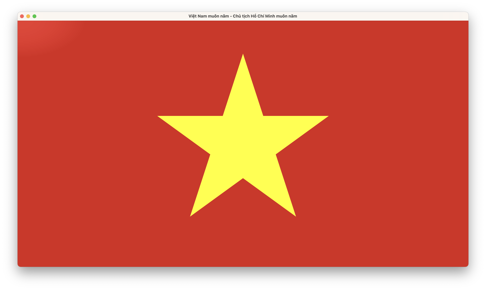

# Draw the Vietnam national flag with flutter

## Getting Started
### Flutter version: 3.22.3

## Screenshot

## Note
This project includes code for the Ripple Shader effect from [Rahiche](https://github.com/Rahiche) and his repository [flutter_custom_visuals](https://github.com/Rahiche/flutter_custom_visuals). I would like to thank Rahiche for sharing his work and making this effect available.

